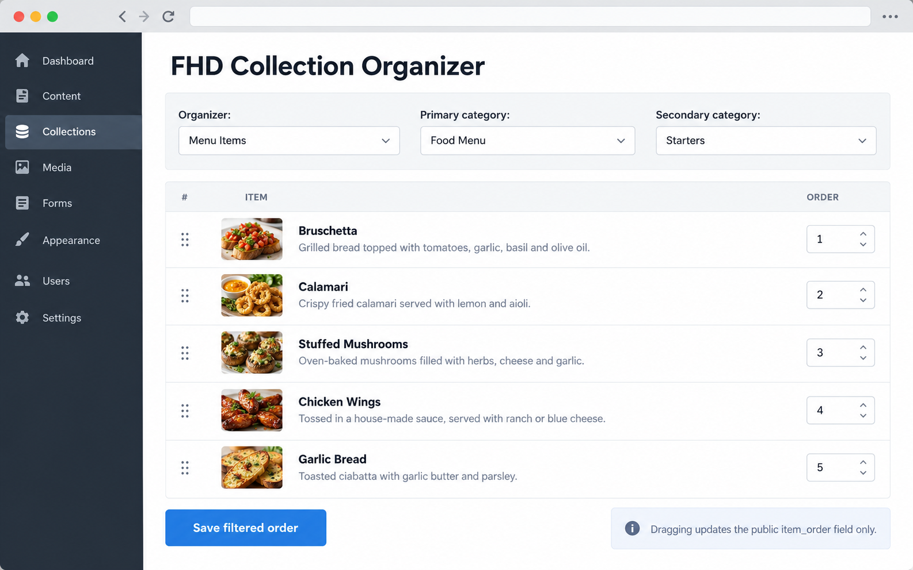

# FHD Collection Organizer

`fhd_runway_collecter` is a standalone Perch Runway admin app for ordering a **filtered subset** of a Collection. An editor can choose a profile, choose one or two category filters, drag just the matching items, and save the public display order.



> The image is an illustrative UI mockup, not a capture from a live Perch installation.

## Requirements

- Perch Runway 3.0 or later, with Collections enabled
- PHP 7.4 or later
- Permission to edit the configured Collection

## Install

1. Copy the `fhd_runway_collecter` directory to `perch/addons/apps/`.
2. In Perch Admin, go to **Settings → Apps**, activate **FHD Collection Organizer**, and grant the `Access FHD Collection Organizer` privilege to the relevant roles.
3. Give only site administrators the separate `Configure FHD Collection Organizer` privilege.
4. Open **FHD Collection Organizer** in the app menu and select **Configure organizers**.

The app creates its own `fhd_collecter_profiles` table at activation. It does not change Collection data until an editor saves an order.

## Configure a profile

Each profile targets one Collection and contains:

- a friendly label;
- the Collection;
- a required primary category-set slug;
- an optional secondary category-set slug;
- an optional title field (otherwise `_title` is used); and
- a required public ordering field, default `item_order`.

Category-set values are the **slugs**, not their display titles. Field values are Collection field IDs. The app intentionally accepts only safe simple field IDs (letters, digits, and underscores) and safe category-set slugs.

For a two-filter profile, choose the primary category first; the secondary select then contains only secondary categories used by items in that primary group. For a one-filter profile, the organizer becomes available after the primary choice.

### Public templates

This app does **not** use or change Perch’s global Collection `itemOrder`. Your public Collection template/query must explicitly sort by the configured field. For example:

```php
perch_collection('Menu Items', [
    'sort'  => 'item_order',
    'sort-order' => 'ASC',
]);
```

Adjust the template call and category filtering for your site. See [the Danny’s-style example](examples/dannys-menu-config.md).

## Safety model

Before writing, the app re-queries the current Collection revision with the chosen category paths. It then verifies that:

1. the user holds both the app privilege and the Collection’s normal edit permission;
2. the submitted list has exactly the same item IDs as the filtered result; and
3. every submitted position is numeric.

Only after that does it update the configured field in each matching item’s JSON and the corresponding `collection_index` row for the current revision. Other items, other fields, and Perch’s global Collection ordering value are left untouched. Items without an order appear after ordered items, using their item ID as a stable tie-breaker.

## Styling

`assets/css/collecter.css` is loaded through Perch’s native `$Perch->add_css()` mechanism. All custom rules are scoped to `.fhd-collecter`; common extension points include:

- `.fhd-collecter__filters`
- `.fhd-collecter__item`
- `.fhd-collecter__item-title`
- `.fhd-collecter__status`

Override these in your own Perch admin stylesheet after the app stylesheet.

## Development checks

Run PHP linting in an environment with PHP installed:

```sh
find . -name '*.php' -print0 | xargs -0 -n1 php -l
```

Then test with a disposable Collection containing known categories and items:

1. Configure a one-filter profile and a two-filter profile.
2. Reorder one group and confirm no other group’s configured ordering values change.
3. Confirm public output sorts on the configured field.
4. Submit a stale or tampered item ID and confirm the request is rejected.
5. Confirm an editor without Collection edit rights cannot access that profile.

## Upgrade notes

Version 1.0.0 is the first standalone release. It is intentionally independent of any site-specific prototype. Back up the Perch database before installing any new admin app.

## License

MIT. See [LICENSE](LICENSE).
